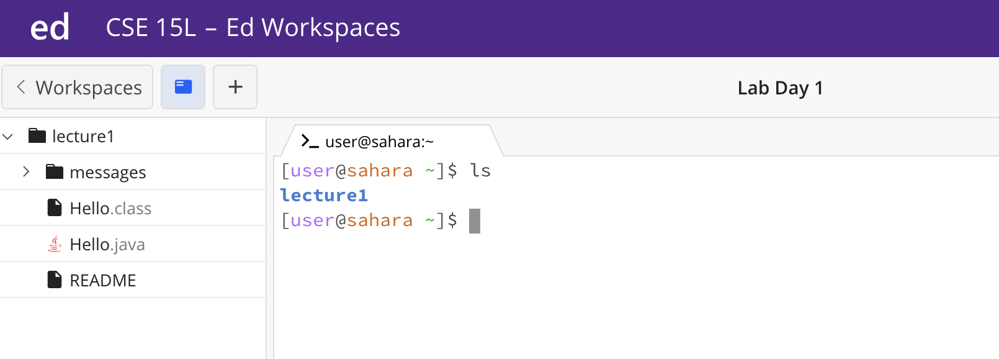
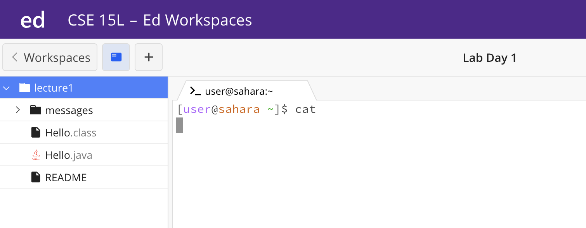
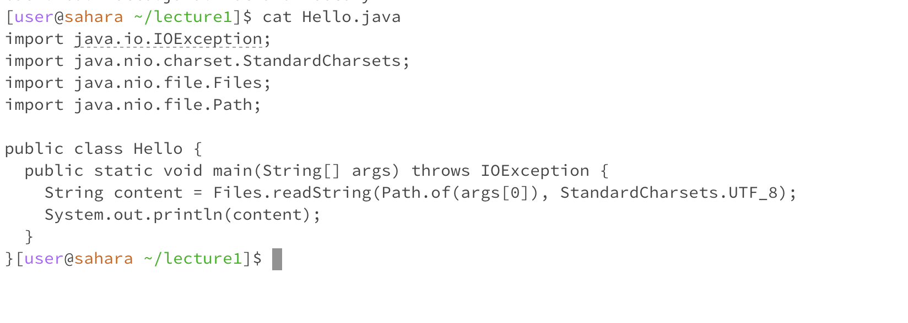
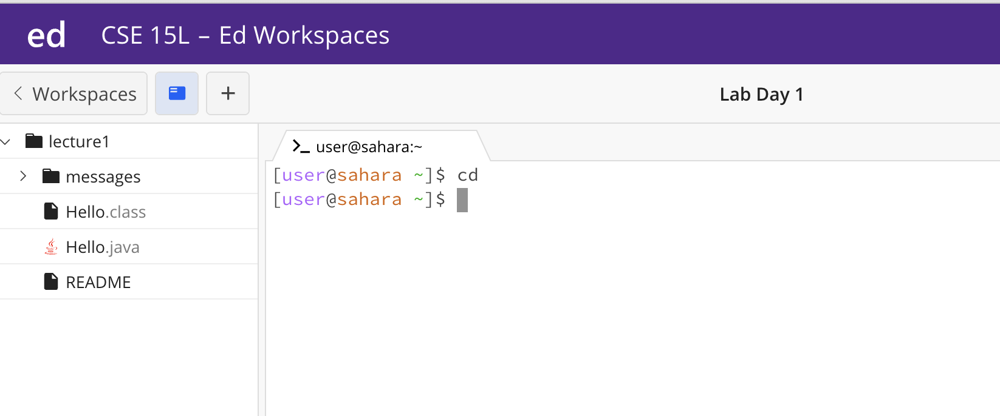
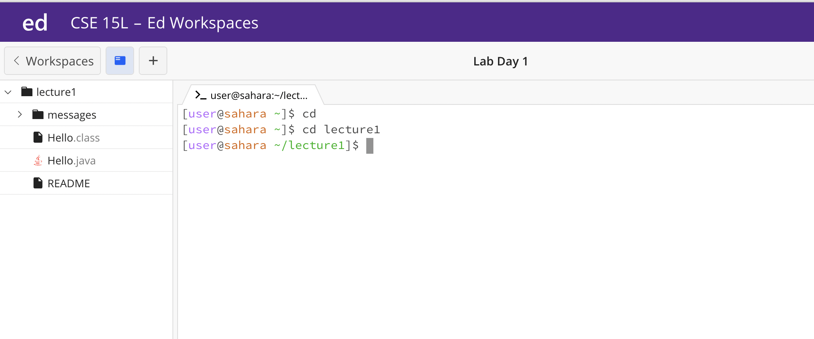

# the ls command

First, I tried typing the ```ls``` or list files command, with no arguments following. This generated an output of ```lecture1```, and there was no error, because the ```ls``` command does not require an argument to search for the list of files- it just searches based on any current directory we are in- which in this case, is just the ```home``` directory.


Next, I tried using ```Hello.java``` as my argument following the ```ls``` command. This resulted in an output of ```Hello.java```, and therefore there was no error, because the only file in ```Hello.java``` is ```Hello.java```. However as we can see, we have made our current directory in this case ```lecture1```.


Finally, I tried using ```lecture1``` as an argument for ```ls``` while again already being in the ```lecture1``` directory, and thus this resulted in an error- if we hadn't already navigated to ```lecture1``` as our current directory, this wouldn't have been the case.


# the cat command

First, I tried typing the ```cat``` or concatenate command, while just being in the ```home``` directory with no arguments following. This did not even run when I hit enter, because the ```cat``` command requires an argument in order to function because it's sole purpose is to read and output a file's contents- so it needs a file to be given. Therefore, it cannot technically count as an error as nothing was ran in the first place.


The ```cat``` command followed by ```lecture1``` which is a directory, creates an error because although it runs since an argument was given, again, we need a file name as the argument in order for this command to execute properly. This is the case even when we are navigated into the ```lecture1``` directory as shown in the picture.


The ```cat``` command followed by ```Hello.java``` works successfully with no errors as the command was intended and outputs the file contents of ```Hello.java``` because it is a valid file name in our ```lecture1``` directory- which we are in when running the command.

# the cd command
 
Running the ```cd``` or current directory command with no arguments following while we haven't navigated to any directory outside of the ```home``` one outputs nothings because we have not navigated to a directory yet. There is no error, but also no output.


Running ```cd``` followed by ```lecture1``` while we are in the ```home``` directory doesn't produce any output, but we can notice that the file path for the next command has changed from ending at the ~ to now ~/```lecture1``` meaning the path has been redirected. This means there were no errors when it ran.


Finally, running ```cd``` followed by ```Hello.java``` while we are in the ```lecture1``` directory results in an error because the current directory command is particular to needing a directory as an argument; a file name will not work here.
