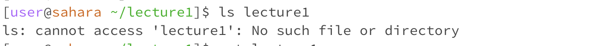

# the ls command

First, I tried typing the ls or list files command, with no arguments following. This generated an output of lecture1, because the ls command does not require an argument to search for the list of files- it just searches based on any current directory we are in.

Next, I tried using Hello.java as my argument following the ls command. This resulted in an output of Hello.java, because the only file in Hello.java is Hello.java.

Finally, I tried using lecture1 as an argument for ls while already being in the lecture1 directory, and thus this resulted in an error- if we hadn't already navigated to lecture1 as our current directory, this wouldn't have been the case.

# the cat command

First, I tried typing the cat or concatenate command, with no arguments following. This did not even run when I hit enter, because the cat command requires an argument in order to function because it's sole purpose is to read and output a file's contents- so it needs a file to be given.

The cat command followed by lecture1 which is a directory, creates an error because although it runs since an argument was given, again, we need a file name as the argument in order for this command to execute properly.

The cat command followed by Hello.java works successfully as the command was intended and outputs the file contents of Hello.java because it is a valid file name in our lecture1 directory (which we are in when typing the command).

# the cd command
 
Running the cd or current directory command with no arguments following while we aren't in any directory outputs nothings because we have not navigated to a directory yet.

Running cd followed by lecture1 doesn't produce any output, but we can notice that the file path for the next command has changed from ending at the ~ to now ~/lecture1 meaning the path has been redirected.

Finally, running cd followed by Hello.java results in an error because the current directory command is particular to needing a directory as an argument; a file name will not work here.
