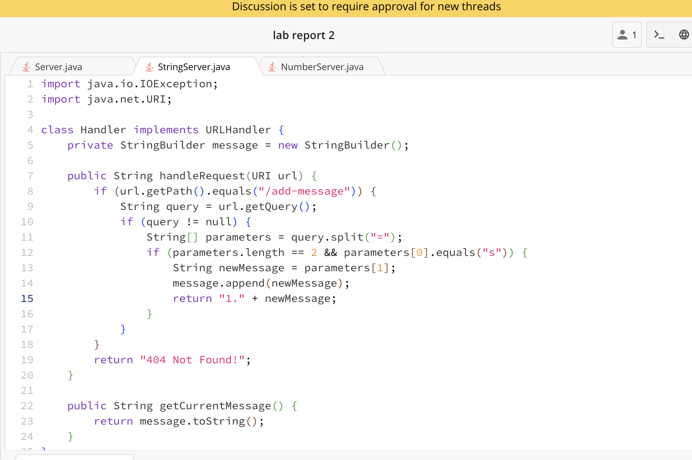
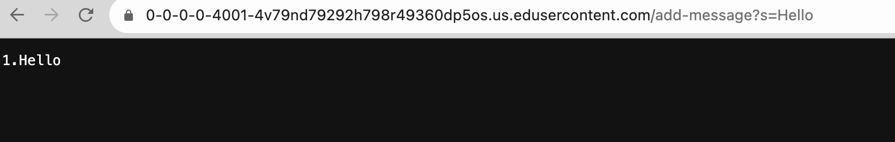
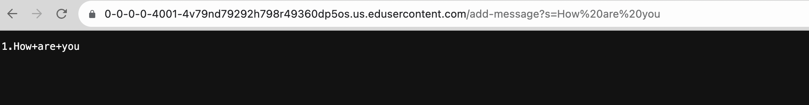

# Lab Report 2: String Server


The ```getCurrentMessage``` method is called here. The ```newMessage``` is taken in as a parameter/input, in which we inputted "Hello" for this case in the server. In /add-message?s=Hello, the program takes out the s= part, changing the value in that way.

The ```getCurrentMessage``` method is called here. The ```newMessage``` is taken in as a parameter/input, in which we inputted "How are you" for this case in the server. In /add-message?s=How are you, the program takes out the s= part, changing the value in that way.
## **From lab weeks 2 and 3, I learned how to run servers. I also learned that each server actually has a port, which is a number, and is often hidden.**
