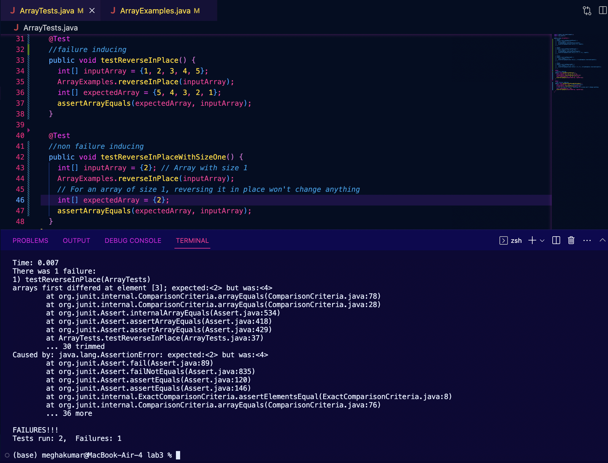

# LAB REPORT 3: BUGS AND COMMANDS

## Part 1- Bugs

My failure inducing test input is as follows:

```  //non failure inducing 
  public void testReverseInPlaceWithSizeOne() {
    int[] inputArray = {2}; // Array with size 1
    ArrayExamples.reverseInPlace(inputArray);
    // For an array of size 1, reversing it in place won't change anything
    int[] expectedArray = {2};
    assertArrayEquals(expectedArray, inputArray);
  }
```
And here is my non failure inducing test input:
```
  public void testReverseInPlaceWithSizeOne() {
    int[] inputArray = {2}; // Array with size 1
    ArrayExamples.reverseInPlace(inputArray);
    // For an array of size 1, reversing it in place won't change anything
    int[] expectedArray = {2};
    assertArrayEquals(expectedArray, inputArray);
  }
```
Next, the symptom, as the output of running the tests:



And finally, the bug, as in my before-and-after code change to fix it:

BEFORE:
```
  static void reverseInPlace(int[] arr) {
    for(int i = 0; i < arr.length; i += 1) {
      arr[i] = arr[arr.length - i - 1];
    }
  }
```

AFTER:
```
  static void reverseInPlace(int[] arr) {
    int start = 0;
    int end = arr.length - 1;

    while (start < end) {
      // Swap elements at start and end indices
      int temp = arr[start];
      arr[start] = arr[end];
      arr[end] = temp;

      // Move indices towards the center
      start++;
      end--;
    }
  }
```
Why does this fix the issue? Well if we look at the code above, we can see that the bug is due to
the code attempting to reverse the array by swapping elements, but it loop iterates over the entire array, and each time
it sets the value at index i to the value at the corresponding position from the end of the array (arr.length - i - 1). 
This overwrites the original values in the array before they are swapped, resulting in incorrect values. 
My corrected version of the reverseInPlace method instead starts with two pointers (start and end) at the beginning and end of 
the array and swaps the elements at these pointers while moving towards the center of the array. This makese sure the values
don't get overwritten.

## Part 2- Researching Commands

## I chose the FIND command to research.

**Search by Type**

```find [path] -type [f/d]``` will search for only a specified type of file so you can limit results to only
files, only directories, etc. This is useful if you are looking to only search for a certain type of item
within a directory if you only want other directories or files.

Searching for only files starting with “India:”

```
$ find written_2 -type f -name "India*"
written_2/travel_guides/berlitz2/India-History.txt
written_2/travel_guides/berlitz2/India-WhereToGo.txt
written_2/travel_guides/berlitz2/India-WhatToDo.txt
```

Searching for only directories:

```
$ find written_2/ -type d
written_2/
written_2//non-fiction
written_2//non-fiction/OUP
written_2//non-fiction/OUP/Berk
written_2//non-fiction/OUP/Abernathy
written_2//non-fiction/OUP/Rybczynski
written_2//non-fiction/OUP/Kauffman
written_2//non-fiction/OUP/Fletcher
written_2//non-fiction/OUP/Castro
written_2//travel_guides
written_2//travel_guides/berlitz1
written_2//travel_guides/berlitz2
```

*commands found on https://www.redhat.com/sysadmin/linux-find-command*


**Search by Keyword**

```find [path] -iname [text]``` will search for the text entered as an approximate file name
meaning it will return any files containing “text,” non-case sensitively. This is useful in case you
donʼt remember the name of a file exactly, or are looking to pull up multiple related files (for
example, all files about Madrid).

Searching for any text files containing “madrid:”

```
$ find written_2/ -iname "*madrid*.txt"
written_2//travel_guides/berlitz1/HistoryMadrid.txt
written_2//travel_guides/berlitz1/IntroMadrid.txt
written_2//travel_guides/berlitz1/HandRMadrid.txt
written_2//travel_guides/berlitz1/WhereToMadrid.txt
```

Searching for any text files containing “hongkong:”

```
$ find written_2/ -iname "*hongkong*.txt"
written_2//travel_guides/berlitz1/HandRHongKong.txt
written_2//travel_guides/berlitz1/HistoryHongKong.txt
written_2//travel_guides/berlitz1/IntroHongKong.txt
written_2//travel_guides/berlitz1/WhatToHongKong.txt
written_2//travel_guides/berlitz1/WhereToHongKong.txt
```

*commands found on https://www.redhat.com/sysadmin/linux-find-command*


**Search for a path**

```find [path] -ipath [text]``` will search for a file and return the path leading to it. This is useful if
you know what file youʼre looking for, but perhaps donʼt know the path to find it exactly.

Searching for path of berlitz1:

```
$ find written_2/ -ipath "*berlitz1"
written_2//travel_guides/berlitz1
```

Searching for path of Bahamas-History.txt:

```
$ find written_2/ -ipath "*Bahamas-History.txt"
written_2//travel_guides/berlitz2/Bahamas-History.txt
```
*commands found on https://www.redhat.com/sysadmin/linux-find-command*


**Limit Depth of Results**

```find [path] -maxdepth [depth]``` will search only within a given depth. This is useful if you are
looking to only search within x number of directories within a given path; if you donʼt want to look
recursively into every single one available.

Searching for files with a depth of 1:

```
$ find written_2/ -maxdepth 1
written_2/
written_2//non-fiction
written_2//.DS_Store
written_2//travel_guides
```

Searching for files with a depth of 2:

```
$ find written_2/ -maxdepth 2
written_2/
written_2//non-fiction
written_2//non-fiction/OUP
written_2//.DS_Store
written_2//travel_guides

written_2//travel_guides/.DS_Store
written_2//travel_guides/berlitz1
written_2//travel_guides/berlitz2
```
*commands found on https://www.redhat.com/sysadmin/linux-find-command*


