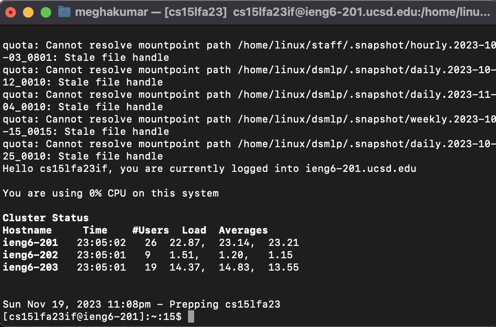
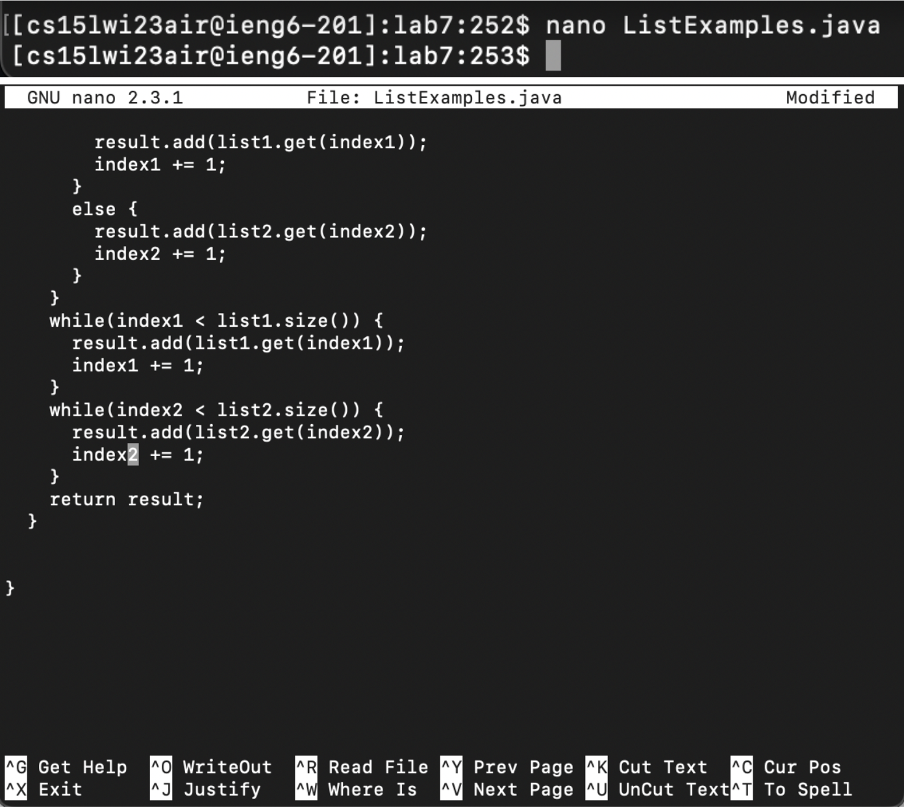

# LAB REPORT 3: VIM

## STEP 4

**Keys pressed:**

ssh cs15lwi23air@ieng6.ucsd.edu `<enter>`
yes
`<command V>` `<enter>`

I typed out the login command to the ieng6 server, followed by typing yes for the 
next prompt, and finally pasted my password when prompted (which I had already copied).

## STEP 5

## STEP 6

## STEP 7

## STEP 8

## STEP 9

