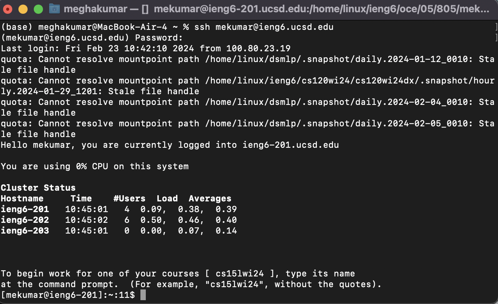
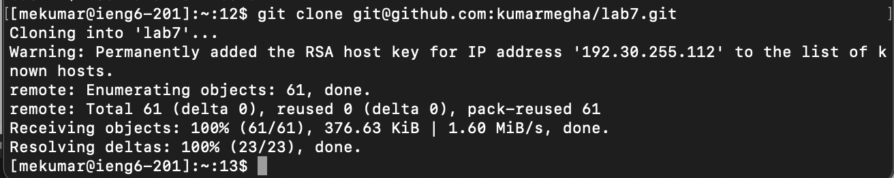
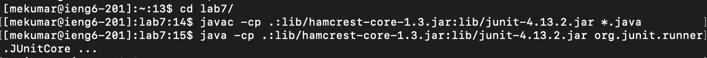
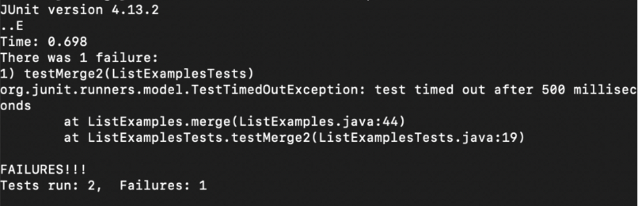
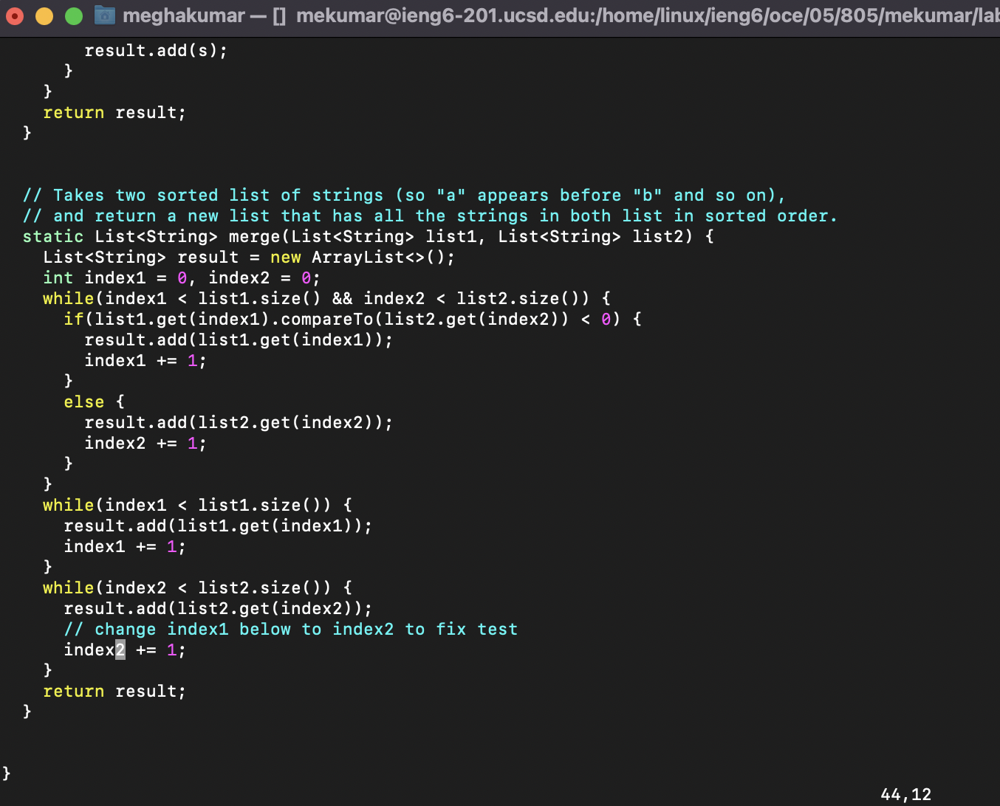
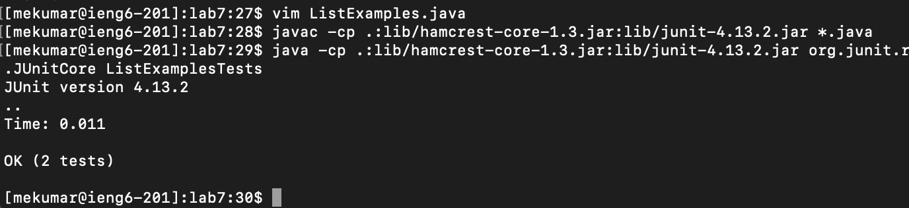
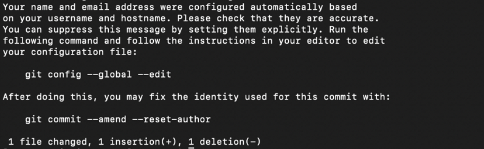
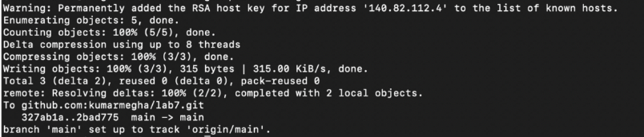

# LAB REPORT 4: VIM

## STEP 4

**Keys pressed:**

ssh cs15lfa23if@ieng6.ucsd.edu `<enter>`
yes
`<command V>` `<enter>`

*I typed out the login command to the ieng6 server, followed by typing yes for the 
next prompt, and finally pasted my password when prompted (which I had already copied).*

## STEP 5

**Keys pressed:**

git clone `<command V>` `<enter>`

*The SSH link from the forked repository was already copied, so I just had to paste it into the terminal to clone
it.*

## STEP 6

**Keys pressed:**

cd la `<tab>` `<enter>`

*I moved into the lab7 directory, typed “la” and pressed tab to autocomplete the path.*

`<up>` `<up>` `<up>` `<up>` `<up>` `<up>` `<up>` `<up>` `<up>` `<up>` `<up>` `<enter>`

*I ran the command to compile all .java files, which was 11 commands up.*

`<up>` `<up>` `<up>` `<up>` `<up>` `<up>` `<up>` `<up>` `<up>` `<up>` `<enter>`

*I ran the command to run the ListExamplesTests file, which was 10 commands up.*

## STEP 7

**Keys pressed:**

vim ListExamples.java

*I opened the vim editor for ListExamples.java file.*

`<right>` `<right>` `<right>` `<right>` `<right>` `<right>` `<right>` 
`<right>` `<right>` `<right>` `<right>` `<right>`
`<delete>` 2

*I scrolled down to the error, moved right 12 times with the arrow keys, deleted the “1” and typed
in “2” to fix the error.*

`<^X>` Y `<enter>`

*I used control X to exit the editor, pressed Y (yes) to save changes, and pressed enter to confirm.*

## STEP 8

**Keys pressed:**

`<up>` `<up>` `<up>` `<enter>`

*I ran the command to compile all .java files, which was 3 commands up.*

`<up>` `<up>` `<up>` `<enter>`

*I ran the command to run the ListExamplesTests file, which was 3 commands up.*

## STEP 9

**Keys pressed:**

git add ListExamples.java `<enter>`

*I added changed file to be committed.*

git commit -m “Fixed error in merge method” `<enter>`

*I committed changes with message “Fixed error in
merge method”.*

git push -u origin main `<enter>`

*I pushed the changes to my GitHub account.*

